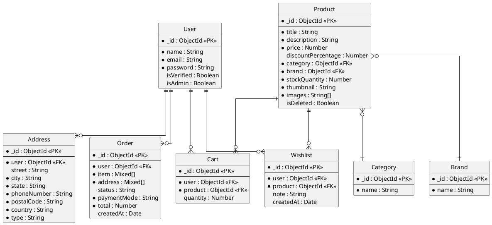
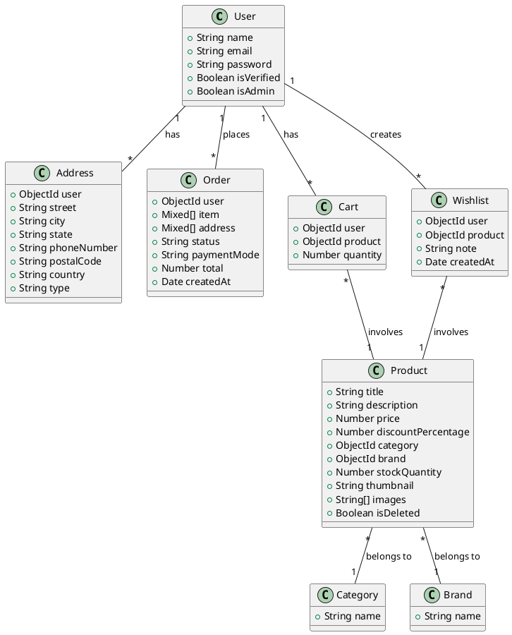
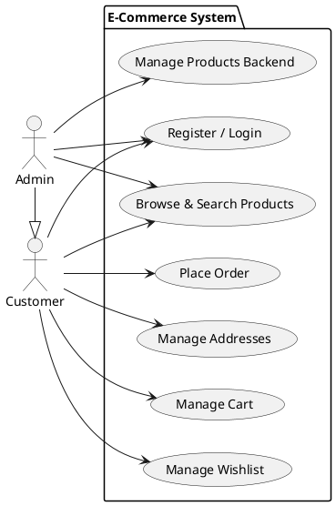
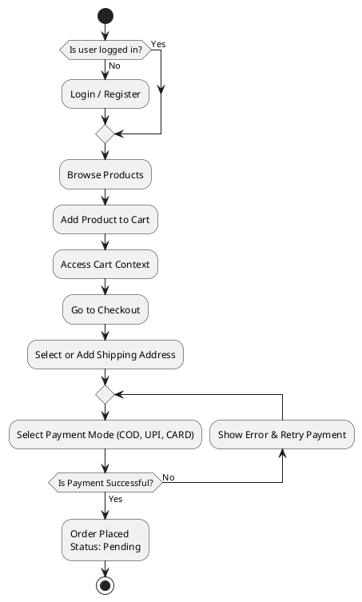
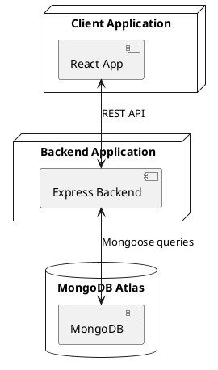
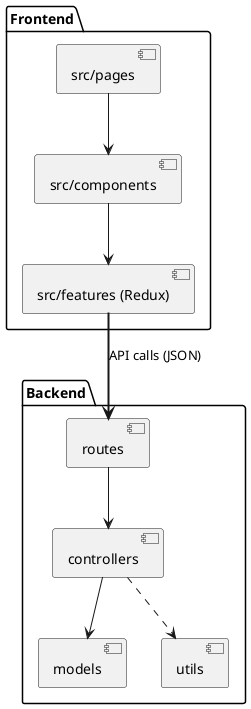
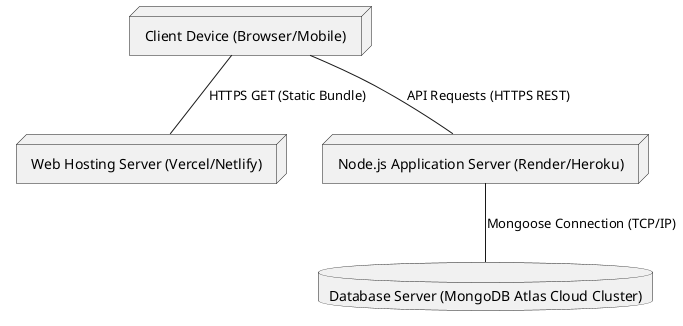
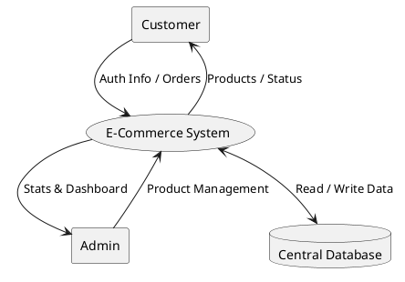
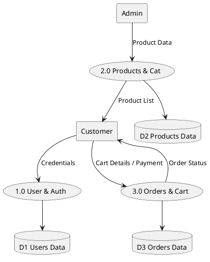

# PlantUML Diagrams for draw.io

You can copy and paste the following blocks directly into Draw.io's "Insert -> Advanced -> PlantUML" feature, or use them in any PlantUML viewer.

## 4. ER Diagram

## 5.1 Class Diagram

## 5.2 Use Case Diagram

## 5.3 Activity Diagram

## 5.4 Component Diagram

## 5.5 Package Diagram

## 5.6 Deployment Diagram

## 7.1 DFD Level 0 (Context Diagram)

## 7.2 DFD Level 1

