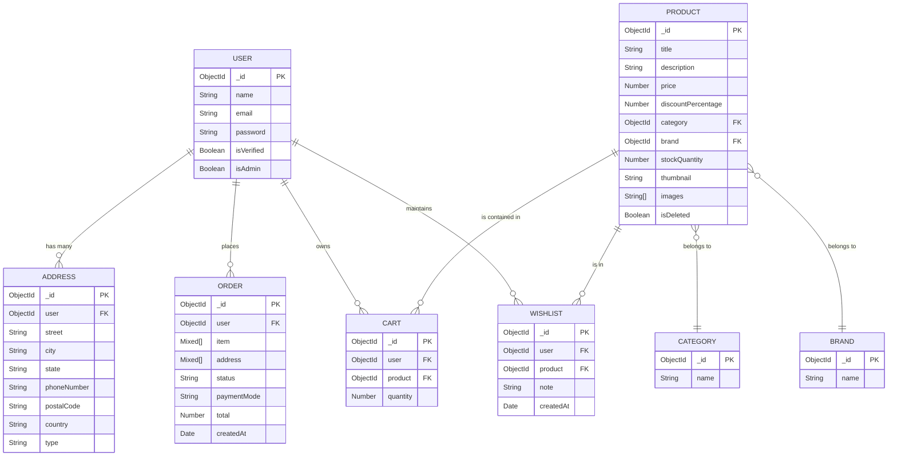
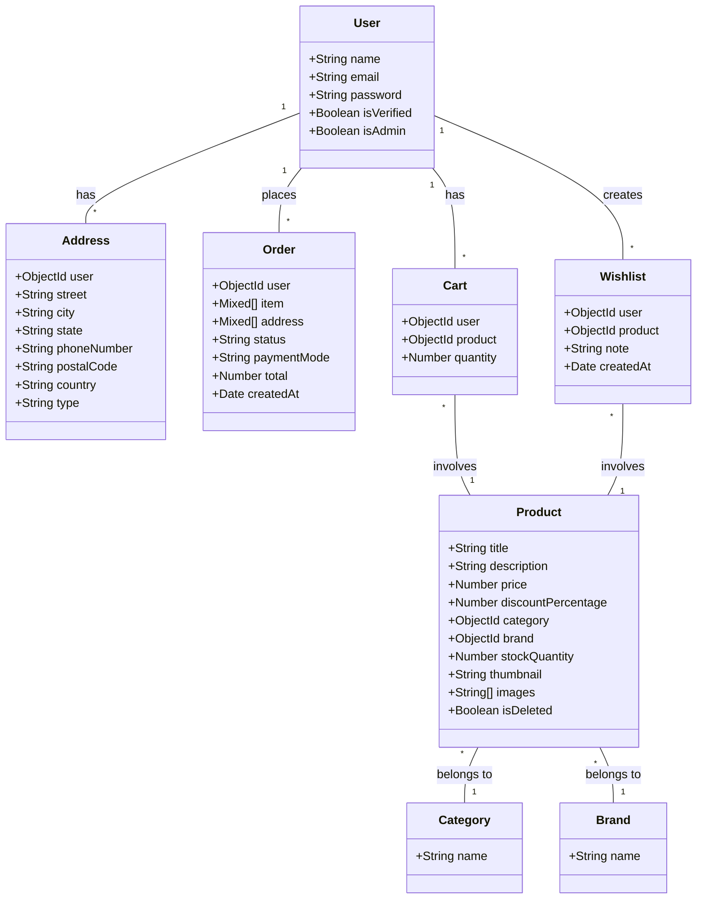
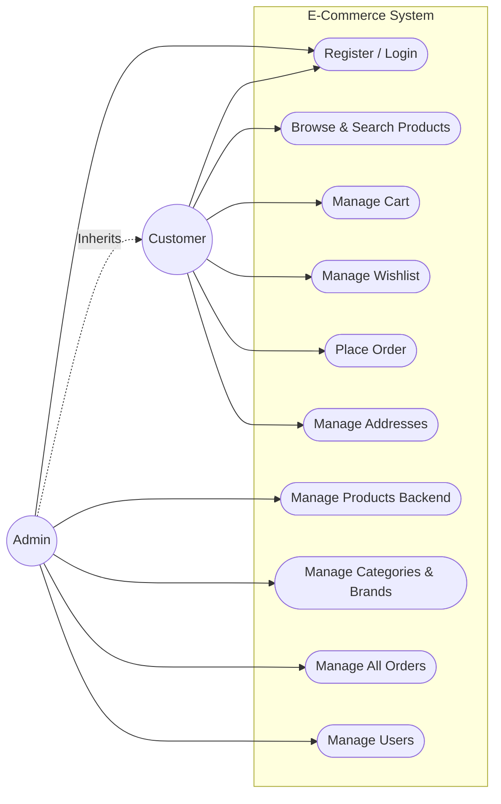
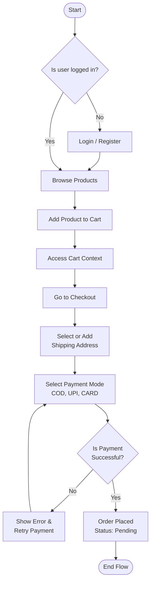
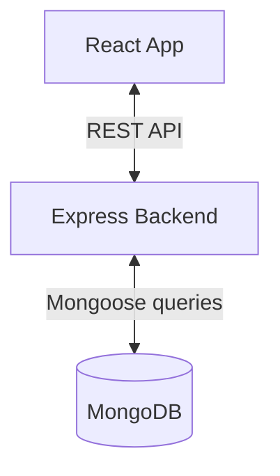
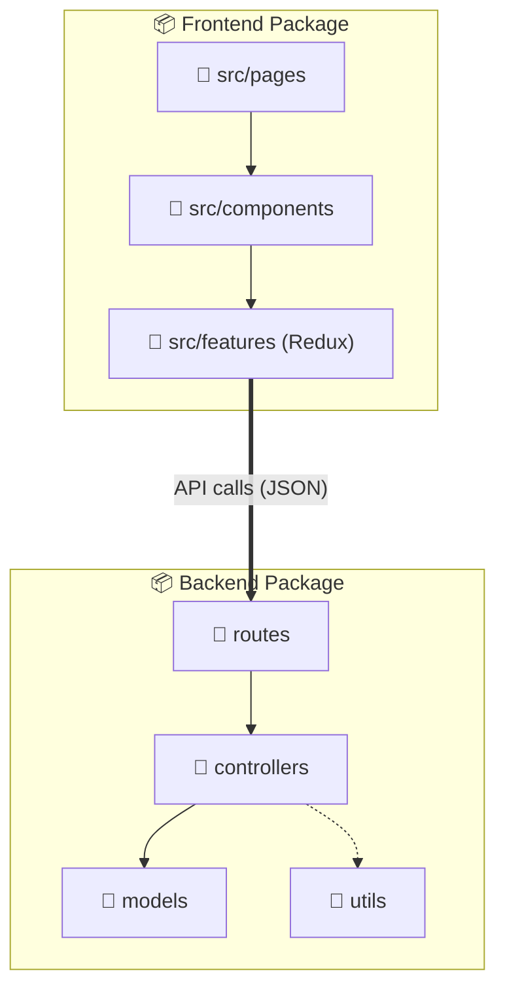
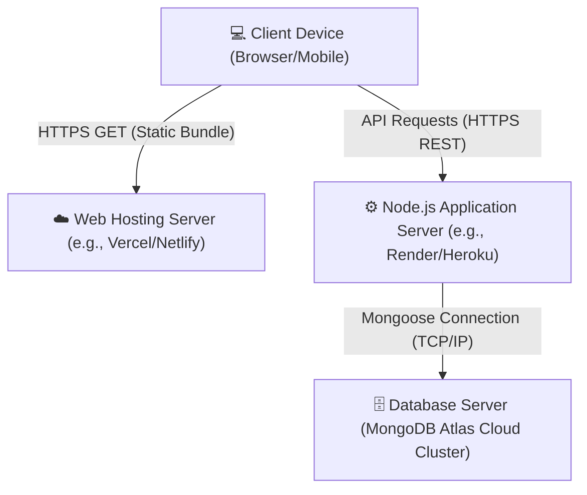
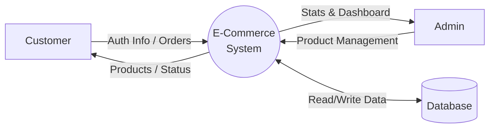
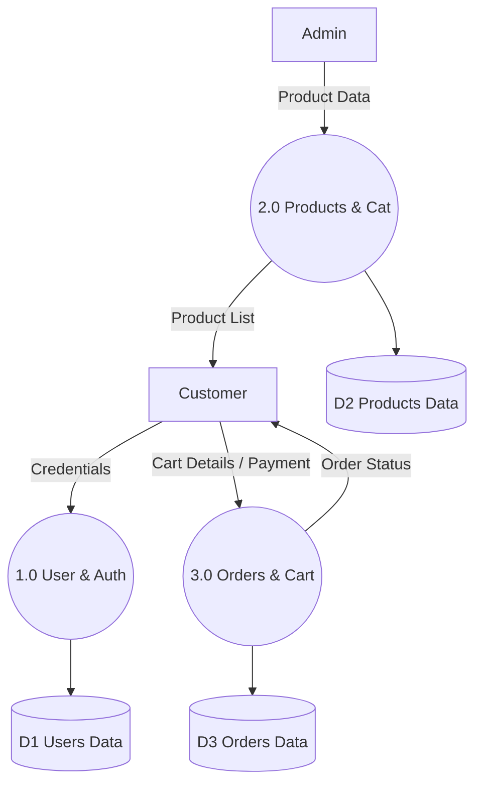

# Project Architecture & Documentation

## 4. ER Diagram
The Entity-Relationship diagram outlines the main entities in the database and their relations based on your Mongoose models.

## 5. UML Diagrams

### 5.1 Class Diagram
Displays the structure of the system's classes, their attributes, and operations.

### 5.2 Use Case Diagram
Visualizes the interactions between the system and its users (actors).

### 5.3 Activity Diagram
Describes the flow of the primary activity: Placing an Order.

### 5.4 Component Diagram
Shows how the system components are wired together.

### 5.5 Package Diagram
Illustrates the structural divisions (packages) of the MERN codebase.

### 5.6 Deployment Diagram
Depicts the physical execution environment of the components.

---

## 6. Data Dictionary
The Data Dictionary provides a detailed breakdown of each field in all major collections within the database.

### `users` Collection (User.js)
| Field Name | Data Type | Required/Unique | Description |
| :--- | :--- | :--- | :--- |
| `_id` | ObjectId | Primary Key | Unique identifier for the user |
| `name` | String | Required | Full name of the user |
| `email` | String | Required, Unique | Email address used for authentication |
| `password` | String | Required | Encrypted/hashed password |
| `isVerified` | Boolean | Default: `false` | True if email authentication (OTP) is verified |
| `isAdmin` | Boolean | Default: `false` | True for administrative privileges |

### `addresses` Collection (Address.js)
| Field Name | Data Type | Required/Unique | Description |
| :--- | :--- | :--- | :--- |
| `_id` | ObjectId | Primary Key | Unique identifier for the address |
| `user` | ObjectId | Ref: User | The associated user who owns this address |
| `street` | String | Optional | Street name/number |
| `city` | String | Required | Name of the city |
| `state` | String | Required | State or province |
| `phoneNumber`| String | Required | Contact phone number |
| `postalCode` | String | Required | Zip code or postal code |
| `country` | String | Required | Country name |
| `type` | String | Required | Type of address (e.g., Home, Work) |

### `products` Collection (Product.js)
| Field Name | Data Type | Required/Unique | Description |
| :--- | :--- | :--- | :--- |
| `_id` | ObjectId | Primary Key | Unique identifier for a product |
| `title` | String | Required | The name / title of the product |
| `description` | String | Required | Detailed description of the product |
| `price` | Number | Required | Standard unit price |
| `discountPercentage`| Number| Default: 0 | Discount applied to the product price |
| `category` | ObjectId | Ref: Category | Foreign key linking to the associated category |
| `brand` | ObjectId | Ref: Brand | Foreign key linking to the associated brand |
| `stockQuantity`| Number | Required | Total items available in inventory |
| `thumbnail` | String | Required | URL to the primary image/thumbnail |
| `images` | [String] | Required | Array of URLs to secondary images |
| `isDeleted` | Boolean | Default: false | Soft deletion flag |

### `orders` Collection (Order.js)
| Field Name | Data Type | Required/Unique | Description |
| :--- | :--- | :--- | :--- |
| `_id` | ObjectId | Primary Key | Unique identifier for an order |
| `user` | ObjectId | Ref: User | User who placed the order |
| `item` | [Mixed] | Required | Array containing the product objects/cart snapshots |
| `address` | [Mixed] | Required | Snapshot array of the delivery address selected |
| `status` | String | Default: 'Pending' | Current status: Pending, Dispatched, Out for delivery, Cancelled |
| `paymentMode` | String | Required, Enum | Expected to be 'COD', 'UPI', or 'CARD' |
| `total` | Number | Required | Total computed cost for the order |
| `createdAt` | Date | Default: Date.now()| Auto-generated timestamp for order placement |

### `carts` Collection (Cart.js)
| Field Name | Data Type | Required/Unique | Description |
| :--- | :--- | :--- | :--- |
| `_id` | ObjectId | Primary Key | Unique identifier for a cart item line |
| `user` | ObjectId | Ref: User | Associated user |
| `product` | ObjectId | Ref: Product | The specific product added to the cart |
| `quantity` | Number | Default: 1 | Quantity of that product set by the user |

### `categories` & `brands` Collections
| Field Name | Data Type | Required/Unique | Description |
| :--- | :--- | :--- | :--- |
| `_id` | ObjectId | Primary Key | Unique identifier |
| `name` | String | Required | Identifying name (e.g., 'Electronics', 'Apple') |

### `wishlists` Collection (Wishlist.js)
| Field Name | Data Type | Required/Unique | Description |
| :--- | :--- | :--- | :--- |
| `_id` | ObjectId | Primary Key | Unique identifier |
| `user` | ObjectId | Ref: User | Associated user |
| `product` | ObjectId | Ref: Product | The product bookmarked |
| `note` | String | Optional | Optional personal note attached by the user |

---

## 7. Data Flow Diagrams (DFD)

### 7.1 DFD Level 0 (Context Diagram)
Shows the system boundaries and its interactions with external entities.

### 7.2 DFD Level 1
Breaks down the main system into high-level sub-processes and data stores.

